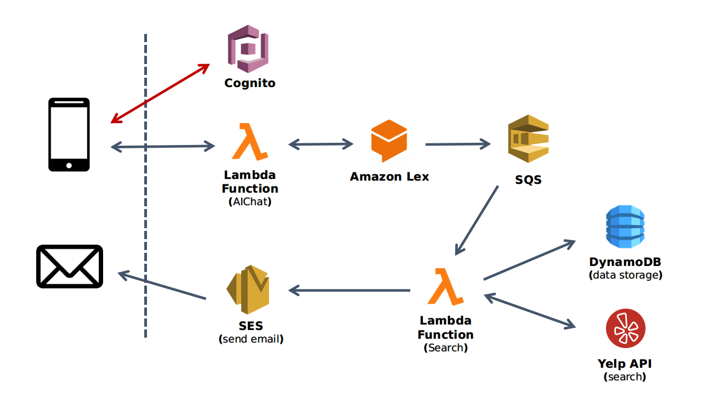

## What we do

This is an intelligent dining service chatbot. The main purpose is to serve the user intent on finding several places recommendation with specific cuisine type. 

After the bot collects the necessary information like location, cuisine and user's email address, the user will receive an email in seconds with nearby dining places recommendation.

Before you use the chatbot service, you need to register an account for identification purpose.

## Demo

- **Youtube**: https://www.youtube.com/watch?v=AoYBiPv-gl8

## Project structure

#### - Cognito

Cognito provides the user pool with management service. This project requires a user to register an account using email or Facebook so that the admin could manage the user, like controls on dining service quota and abuse prevention.  

#### - Lambda Function(AIChat)

It fulfills the interface for the bot to chat with the user. To be specific, it takes the input chat from the user, sends it to the Amazon Lex component, then receives the response from the Lex and sends it back to the frontend chat box. 

#### - Amazon Lex

Amazon Lex is a service for building conversational interfaces into any application using voice and text powered by deep learning. We leverage it to understand the user's intent, elicit necessary information(slot data) from the user, and then use them for a specific business task. 

The Amazon Lex cooperates with two extra lambda function. One is for initialization and input validation, while the other one is for fulfilling the intent, namely implementing the actual business logic. 

#### - SQS

Amazon Simple Queue Service (SQS) is a queuing service for decoupling and scaling microservices, distributed system, and serverless application. 

In our application, after all the necessary information(slot data) is collected, the Amazon Lex invokes the lambda function fulfilling the intent, which means it sends a SQS message with slot data to the SQS queue. Then it triggers the next lambda function(Search) to do jobs like searching restaurant, storing data, etc. 

#### - Lambda Function(Search)

This Lambda function does such things in order:

(1) Leverage Yelp API to search restaurants with two parameters, the location, and the cuisine type.

(2) Store the restaurant data in DynamoDB. For now, the DynamoDB is for logging use.

(3) Call Amazon SES service to send email to the user with restaurants we found in the previous step.

#### - DynamoDB

For now, it stores the restaurants result from Yelp API searching response. 

#### - Yelp API

Yelp Fusion API provides convenient RESTful API to search restaurants with customized requirements.

#### - SES

Amazon SES is a convenient service to send email to users. 

Please notice that for developers in the sandbox mode, they can only send email to those email addresses that have been validated. 